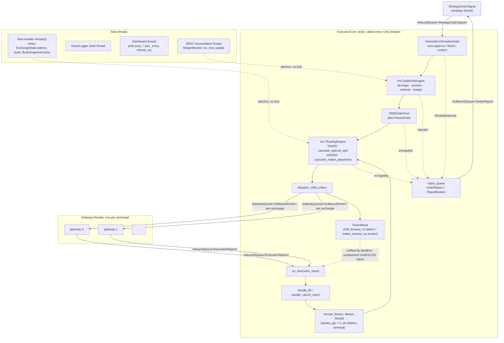

# Smart Order Router + Order Management System

A C++20 SOR and the institutional OMS wrapped around it. Built as two
independent layers on purpose, not two halves of one blob: the SOR is a
stateless decision function (given a book snapshot and a target size, what do
I send where), the OMS owns everything stateful around it (risk, position,
lifecycle, retries). You can lift `sor/` out and drop it into a much dumber
bot; you cannot lift `oms/` out without the SOR, it's built assuming that
decision function exists underneath it.

Both layers share the same constraints: no heap on the hot path, no
exceptions, `alignas(64)` on anything a network thread and the execution
thread touch concurrently, integer arithmetic until a decision is made and
doubles only show up to report it.

---

## Architecture



`tick()` is one iteration of what used to be inlined into `run()`'s loop: drain
both inbound queues, advance the timer wheel, check margin warnings. `run()`
is just `while(running_) tick(now_ns());` now, `tick()` is public so a test
(or any caller that wants its own scheduling) can drive time forward
deterministically instead of actually sleeping past a timeout to prove
something fires. Nothing in the `EXEC` box blocks except the notional gate's
stdin prompt, and that's intentional, see [Design decisions](#design-decisions).
Everything outside it talks to the execution thread through SPSC queues or
plain atomics, never a mutex.

---

## Design decisions

The parts that aren't obvious from reading the code top to bottom.

**Two libraries, one boundary.** `sor::RoutingEngine::calculate_optimal_split`
takes a `RoutingContext` and returns a `SplitResult`. No side effects, no
state carried between calls beyond a reusable scratch workspace. `oms::ExecutionCore`
is the opposite: it's all state (pools, positions, margin, timers) and it
calls the SOR the same way it'd call any pure function. This split means the
SOR's correctness can be reasoned about (and tested) with zero knowledge of
order lifecycles, retries, or risk, and the OMS's correctness can be reasoned
about while treating "what does the SOR return" as a black box with a
contract, not an implementation to trust.

**Integer ticks and lots on the hot path.** `price_t`/`qty_t` are `int64_t`.
`remaining_lots == 0` is an exact test. No epsilon, no float drift across a
K-way merge, no "close enough" bugs that only show up after 40,000 orders.
Doubles only appear once a fill decision has already been made, purely for
reporting USD values back out.

**Cache-line alignment + SPSC, not locks.** The network thread updates
`LatencyTracker.ewma_rtt_us` (an atomic) while the execution thread reads it
mid-decision. `alignas(64)` on the structs that get touched from both sides
stops false sharing from turning a lock-free read into a cache-coherency
tax. Every queue between threads is a single-producer single-consumer ring
buffer (`SpscQueue<T, N>`), not a general MPSC queue, because SPSC is the one
lock-free queue shape you can get right without a paper. If you need multiple
strategies feeding one `ExecutionCore`, that's multiple SPSC queues drained
in sequence, not one shared queue, the moment you need MPSC here the whole
lock-free argument needs revisiting.

**No heap, no exceptions, no RTTI on the hot path.** `-fno-exceptions
-fno-rtti` is a project-wide compile flag, not just a hot-path one, so there's
one build config to reason about instead of two. It forces the `Result<T>`
pattern (`{value, ok}`, checked explicitly) everywhere an exchange SDK would
normally throw. The tradeoff shows up in the test suite: Catch2 auto-detects
`-fno-exceptions` and switches `REQUIRE` from "unwind to the next test case"
to "abort the whole binary", which is a real cost, see [Testing](#testing).

**Flat pre-allocated pools, LIFO free lists.** `OMSOrderPool` is ~2.8 MB,
sized for 4096 parents and 32768 children at compile time, allocated once,
never resized. `alloc_parent()`/`alloc_child()` are an array index and a
pointer decrement, `free_*()` is a push back onto the free list. No allocator
jitter, no fragmentation, and the failure mode when you run out is a checked
`Result<T>::fail()`, not an `std::bad_alloc` from three call frames away
during a fill.

**Single-threaded execution core.** `ExecutionCore::run()` busy-spins on one
thread: pop a signal, pop a report, tick the timer wheel, repeat. No lock ever
sits between "decide to reroute" and "actually reroute", because there's only
one thread that could contend for it. Scaling past what one core can do means
sharding by instrument across multiple `ExecutionCore` instances, not adding
threads inside this one.

**Margin is two numbers, and the risk engine trusts whichever is worse.**
`MarginMonitor` keeps a local, zero-latency estimate (updated inline on every
fill) alongside the exchange's REST-reported ground truth (100ms-2s stale).
`PreTradeRiskEngine` always reads the conservative one. A fast, slightly wrong
local number that leans towards blocking trades is a much safer default than
a slow, correct one that might arrive after you've already blown through your
margin.

**One instrument table, everyone reads it.** `lot_size` used to be configured
in four independent places that had to agree by convention: `RiskLimits`,
`NotionalConfirmationGate`'s constructor, `RoutingContext`'s fallback, and
`cfg.dashboard.lot_size` doing double duty as a stand-in everywhere else
needed a default. The last one was an actual bug, not just duplication:
`handle_fill`/`handle_cancel_reject` summed `ExecutionReport.fill_qty_lots`
(native to whichever exchange the fill came from) straight into
`parent.cum_qty_lots` and `pos_.net_qty_lots` (the instrument's canonical
unit) with no conversion, so a fill from an exchange with a different native
lot size silently under- or over-counted the position. `InstrumentTable` is
now the one place `lot_size` lives, `PreTradeRiskEngine` and
`NotionalConfirmationGate` both hold a copy (same pattern as `RiskLimits`,
not a reference, no construction-order dependency to get wrong), and
`ExecutionCore::to_canonical_lots` converts every fill through it before
touching anything at the parent or position level.

**Rejects are a queue, not a log line.** Every place a signal can die,
`PreTradeRiskEngine`, the notional gate's hard block, pool exhaustion at
either the parent or child level, or the SOR finding no liquidity, pushes an
`OrderReject` (instrument, direction, qty, and a `RejectReason`) onto
`ExecutionCore::reject_queue`. The reason enum is deliberately flat: no
separate "retryable" flag, `RISK_*`/`NOTIONAL_GATE_BLOCK` already mean "fix
the order" and `POOL_EXHAUSTED`/`NO_LIQUIDITY` already mean "try again
later", a strategy can switch on the reason directly instead of needing a
second field to interpret it. A partial dispatch (see `DISPATCH_GAP` in
`dispatch_child_orders`) is deliberately not a reject: that portion is still
alive and tracked on its parent, not dead.

**Lot sizes are canonicalized per routing decision, not globally.**
`RoutingContext::reference_lot_size` declares what "1 lot" means for one
specific `calculate_optimal_split` call. Every active exchange's book gets
converted into that unit before the merge/fill math runs, so mixing a linear
BTC book (0.001 BTC/lot) with an inverse USD contract book (1 USD/lot) in the
same call produces a correct split instead of silently treating "10 lots" as
the same real-world quantity on both venues. Leave it at 0 and it falls back
to the first active exchange's native lot size, which is exactly the old
(single-lot-size-only) behavior, so nothing breaks if you don't need this.
`ExecutionCore` always sets it explicitly from `InstrumentTable` instead of
relying on that fallback, direct `sor::RoutingEngine` callers (like
`main_example.cpp`) still get the fallback for free.

**Maker is post-then-sweep, not a parallel strategy.** `StrategyOrderSignal::order_type
= MAKER` posts one passive order at the touch (`calculate_maker_placement`,
BID side for BUY, ASK side for SELL, the mirror of which side the taker path
reads) and starts a `maker_timeout_ns` clock instead of `child_timeout_ns`.
Nothing else about the pipeline changes: the same `dispatch_child_orders`,
the same `TimerWheel`, the same `on_execution_report`/`handle_fill` path a
taker child already used. If the maker order fills before the timeout,
done. If it doesn't, the timeout fires the exact same cancel-on-timeout
callback a taker child's timeout would, which routes into
`handle_cancel_reject` and, since `reroute_leaves` always calls the TAKER
SOR regardless of how a parent got here, the unfilled remainder gets swept
as taker automatically. No new state machine, no code path that needs to
know "was this originally a maker order", `reroute_leaves` needed zero
changes to do the sweep correctly. `calculate_maker_placement` never splits
across venues on purpose: posting the same size on multiple books at once
risks a double fill with no coordination between them, out of scope for v1.

**The timer wheel's clock has to be primed before its first real tick, or
it doesn't come back.** `TimerWheel::now_ns_` defaults to 0. `tick(now)`
catches up to `now` by walking forward `tick_ns_` (1ms) at a time, which is
fine if `now` is close to `now_ns_` already, and catastrophic if it isn't:
the first-ever call in a real deployment would have to walk from 0 up to the
real epoch, roughly 1.7e12 steps. `ExecutionCore`'s constructor now calls
`timer_wheel_.reset_clock(now_ns())` to fix that, `reset_clock()` already
existed for exactly this, nothing was calling it. This was completely
invisible for this repo's entire history because nothing, including
`oms_example.cpp`, ever actually called `run()`/`tick()`, every verification
in this README up to this point only ever exercised `on_strategy_order`/
`on_execution_report` directly. Building a hybrid-maker test that genuinely
needed to advance time past a timeout is what first called `tick()` for
real and caught it. A second, independent bug came with it: `check_slot`
used to require `now_ns_ >= entry.deadline_ns` exactly, but `now_ns_` and a
given deadline come from two different real timestamps with unrelated
sub-tick remainders, so that comparison could spuriously come back false on
the correct pass and then not fire until the wheel's next full lap. Fixed by
firing on reaching the deadline's bucket at all, not on an exact value
comparison, correct to the wheel's own `tick_ns_` resolution by
construction. Also raised `kFineSlots` from 1024 to 8192: at 1024, the
wheel's ~1.024s of total coverage was already smaller than the *existing*
`child_timeout_ns` default (2s), so any timeout longer than that range
aliased onto an earlier slot and could fire early. `ExecutionCore` grew from
~2.8 MB to ~9.1 MB as a result, still "heap-allocate it" advice, just a
bigger number, see [Using it](#using-it). None of this was reachable from
any test in this repo until this session, standalone `TimerWheel` tests all
happened to use clean, `tick_ns_`-aligned numbers that couldn't expose
either bug, and nothing ever drove `ExecutionCore`'s wheel with real
timestamps.

---

## Repository layout

```
oms-order-management-system/
├── .github/workflows/ci.yml  # build+test on Release, build+run on ASan/UBSan
│
├── sor/                      # pure decision function, no lifecycle state
│   ├── types.hpp             # price_t/qty_t, ChildOrder, CostSlice, SplitResult
│   ├── normalized_book.hpp   # SoA order book, precomputed cumulative qty
│   ├── exchange_state.hpp    # LatencyTracker, LotConstraints, RoutingContext
│   └── routing_engine.hpp/cpp
│
├── oms/                      # everything stateful: lifecycle, risk, position
│   ├── oms_types.hpp         # StrategyOrderSignal, ExecutionReport, InstrumentTable, OrderReject, Result<T>
│   ├── order_pool.hpp        # ParentOrder, ChildOrderState, OMSOrderPool
│   ├── position_tracker.hpp  # InstrumentPosition, MarginState
│   ├── risk_engine.hpp       # PreTradeRiskEngine
│   ├── notional_gate.hpp     # NotionalConfirmationGate
│   ├── margin_monitor.hpp    # MarginMonitor, two-layer margin model
│   ├── spsc_queue.hpp        # SpscQueue, GatewayQueue/InboundQueue/OutboundQueue aliases
│   ├── timer_wheel.hpp       # TimerWheel, cancel-on-timeout
│   ├── book_snapshot.hpp     # BookSnapshotCache, feed-handler-written vol/imb
│   ├── logger.hpp            # AsyncLogger, lock-free ring + drain thread
│   ├── dashboard.hpp         # Dashboard, live terminal snapshot thread
│   └── execution_core.hpp/cpp # ExecutionCore, ties all of the above together
│
├── tests/
│   ├── test_oms.cpp          # Catch2 suite, SOR + OMS component + integration tests
│   └── catch_amalgamated.*   # vendored Catch2, see tests/LICENSE.txt
│
├── main_example.cpp          # standalone SOR demo, no OMS involved
├── oms_example.cpp           # full pipeline demo, 5 exchanges, one order
└── CMakeLists.txt
```

### Component responsibilities

| Component | Owns | Explicitly does not |
|---|---|---|
| `sor::RoutingEngine` | Splitting a target size across N exchange books (TAKER), or picking the single best venue to post passively on (MAKER) | Remember anything about a previous call, know what an "order" is beyond a size and a direction, split a MAKER placement across venues |
| `oms::InstrumentTable` | The one `lot_size` every other component reads | Tick size, symbols, anything beyond what's needed today |
| `oms::PreTradeRiskEngine` | Fat-finger, position limit, notional, margin checks, ~100ns budget | Know about exchanges, books, or the SOR at all |
| `oms::NotionalConfirmationGate` | The one deliberately blocking call in the pipeline | Run on the execution thread's hot path for small orders (auto-approves below threshold) |
| `oms::OMSOrderPool` | Parent/child order storage, O(1) alloc/free | Allocate anything after startup |
| `oms::MarginMonitor` | Reconciling a fast local estimate against slow REST ground truth | Trust the fast estimate when it disagrees optimistically with REST |
| `oms::TimerWheel` | Cancel-on-timeout for dispatched children | Retry logic, that's `reroute_leaves`'s job once a cancel report comes back |
| `oms::ExecutionCore` | Wiring all of the above into one order lifecycle, notifying `reject_queue` on every dead end | Run on more than one thread |

---

## How the SOR works

Three phases, all on the stack, `RoutingEngine::calculate_optimal_split`:

1. **Build** (`build_cost_slices`): one `Cursor` per active exchange. Per-cursor
   cost = taker fee + dynamic latency penalty (EWMA RTT scaled by
   short-term vol and book imbalance), expressed as an integer tick offset so
   the merge loop never touches the FPU. Native exchange lot sizes get
   converted into the call's canonical unit here too, see
   [reference_lot_size](#design-decisions).

2. **Merge**: K-way merge of up to `kMaxExchanges` (5) sorted book sides.
   Linear scan across the cursors to find the minimum effective price per
   step, not a heap, `std::priority_queue` loses to a linear scan at K=5.

3. **Fill** (`greedy_fill`): greedy sweep over the merged, cost-sorted slices.
   Monotonic effective prices make greedy provably optimal here. Integer the
   whole way through, `remaining_lots -= fill_lots` with no rounding, doubles
   only appear once writing `ChildOrder`/`SplitResult` for reporting.

Depth is bounded at `kMaxDepth` (20) levels per exchange side,
`kMaxChildOrders = kMaxExchanges × kMaxDepth = 100` child orders is the hard
ceiling for one split.

`RoutingEngine::calculate_maker_placement` is a different, much shorter
algorithm for `order_type = MAKER`: no merge, no greedy fill, because it
isn't consuming book depth, it's posting one order at the touch. For each
active exchange, read the touch on your own side (BID for BUY, ASK for
SELL, the opposite of which side `calculate_optimal_split` reads for the
same direction), adjust it by that exchange's maker fee (`FeeMatrix::maker`,
which can be negative, a rebate makes a given price more attractive without
any special-casing), and keep the best one. `out.count` is 0 or 1, this
never splits a maker order across venues, posting the same size on multiple
books at once risks a double fill with no coordination between the two.
`SplitResult::filled_qty` is always 0 here (a placement isn't a fill),
`spread_capture_bps` reports the distance from the posted price to the
book's opposite touch, how much spread this placement is positioned to
capture if it fills as posted.

---

## How the OMS works

`ExecutionCore::on_strategy_order`, one signal end to end:

1. `NotionalConfirmationGate::approve`, auto-approve, hard-block, or a
   blocking stdin confirmation depending on USD notional. A hard block or a
   "no" at the prompt pushes `RejectReason::NOTIONAL_GATE_BLOCK` onto
   `reject_queue`.
2. `pool_.alloc_parent()`, fails cleanly and gets counted
   (`parent_alloc_failures()`) instead of corrupting state if the pool's full,
   and pushes `RejectReason::PARENT_POOL_EXHAUSTED`.
3. `PreTradeRiskEngine::validate`, fat-finger, then position limit, then margin
   (which itself can reject for `NOTIONAL` or `MARGIN`, propagated as the real
   reason, not collapsed into one). Each maps to its own `RejectReason`.
4. `build_routing_context` + the SOR, `calculate_optimal_split` for TAKER
   (the default) or `calculate_maker_placement` for `order_type = MAKER`,
   picked in `on_strategy_order` by a single ternary, everything else in
   this list is identical either way. The SOR runs exactly once per signal
   here, with no memory of anything before it. Zero liquidity pushes
   `RejectReason::NO_LIQUIDITY`.
5. `dispatch_child_orders`, one `alloc_child()` + `timer_wheel_.insert()`
   per child, pushed onto that exchange's `GatewayQueue<OutboundOrder>`. A
   maker child gets `maker_timeout_ns` on the clock instead of
   `child_timeout_ns`, picked per-child off `co.type`, same `TimerWheel`,
   same callback either way. If fewer children make it out than the SOR
   intended, whether from the child pool running out or hitting
   `ParentOrder::kMaxChildrenPerParent`, the undispatched remainder's margin
   reservation is released immediately (`DISPATCH_GAP`, see
   `to_canonical_lots`), and if literally nothing made it out,
   `RejectReason::CHILD_POOL_EXHAUSTED` is pushed and the parent is freed
   instead of parked forever.
6. Fills and cancels arrive on `exec_report_queue`, `on_execution_report`
   routes to `handle_fill` or `handle_cancel_reject`. Both convert the
   report's `fill_qty_lots` (native to whichever exchange it came from) into
   the instrument's canonical unit via `to_canonical_lots` before touching
   `parent.cum_qty_lots` or `pos_`, so mixed-lot-size fills don't corrupt
   position or margin accounting.
7. If a parent still has `leaves_qty_lots > 0` once all its current children
   are terminal, whether they got there via a fill or a cancel,
   `reroute_leaves` rebuilds the `RoutingContext` from the current book state
   and calls `calculate_optimal_split`, TAKER, always, regardless of what
   the parent's original `order_type` was. This is the entire mechanism
   behind "post as maker, sweep the rest as taker": a timed-out maker child
   reaches this step exactly the same way a canceled taker child would, and
   `reroute_leaves` doesn't need to know or care which one happened. Still
   no liquidity here either pushes `RejectReason::NO_LIQUIDITY` for the gap
   and frees the parent.

The timer wheel fires independently of all of this: if a child sits in
`PENDING_NEW`/`PARTIALLY_FILLED` past its deadline, `child_timeout_ns` for a
TAKER child or `maker_timeout_ns` for a MAKER one, the wheel's callback
synthesizes a `CANCELED` execution report and routes it through the exact
same `on_execution_report` path a real exchange cancel would take, no
special casing for timeouts, or for maker vs. taker, anywhere downstream of
that.

---

## Threading model

| Thread | Reads | Writes | Sync |
|---|---|---|---|
| Execution (`ExecutionCore::run`, one `tick()` per iteration) | `strategy_queue`, `exec_report_queue`, all `ExchangeState`, `BookSnapshotCache` | `pool_`, `pos_`, `routing_ctx_`, `timer_wheel_` | SPSC pop, relaxed/acquire loads on shared atomics |
| Feed handler(s) | market data | `ExchangeState.latency`, `.book`, `BookSnapshotCache` | atomic stores, release |
| Gateway (per exchange) | `GatewayQueue<OutboundOrder>` | exchange socket, `exec_report_queue` | SPSC pop/push |
| REST reconciliation | exchange REST API | `MarginMonitor` (`on_rest_update`) | atomic stores |
| Logger drain | `AsyncLogger`'s ring buffer | stdout/file | SPSC-style ring, lock-free |
| Dashboard | `pool_`, `pos_` (const refs) | stderr | none, read-only polling |

Nothing here takes a lock. The only place the pipeline can block is the
notional gate's stdin confirmation, and that's a deliberate, named exception,
not an oversight.

---

## Build

```bash
git clone https://github.com/tfrmma/oms-order-management-system.git
cd oms-order-management-system

mkdir build && cd build
cmake .. -DCMAKE_BUILD_TYPE=Release
make -j$(nproc)

./sor_example     # standalone SOR demo
./oms_example     # full OMS pipeline demo
```

Requires C++20 and GCC or Clang. Tested on GCC 13, Ubuntu 24. `-march=native` is on by default in Release.

`.github/workflows/ci.yml` runs the same Release build+test+smoke-test path
plus a separate ASan/UBSan job on every push and PR to `main`.

ASan + UBSan build:
```bash
cmake .. -DCMAKE_BUILD_TYPE=Debug
make oms_example_san oms_tests_san -j$(nproc)
./oms_example_san
./oms_tests_san
```

`oms_tests_san` exists because `oms_example_san` alone didn't catch a real
stack-overflow-turned-SIGSEGV bug (`ExecutionCore` grew past what a default
thread stack tolerates, see [Design decisions](#design-decisions)), the test
binary constructs many `ExecutionCore` instances and is a better sanitizer
target for exactly that class of bug than the demo is.

## Testing

Catch2 (vendored amalgamated in `tests/`, see `tests/LICENSE.txt`):
```bash
make oms_tests -j$(nproc)
./oms_tests
```

28 test cases, ~4260 assertions. Covers the SOR merge/fill algorithm (single
and multi-exchange, partial fills, limit price clipping, BUY/SELL sign
handling, mismatched lot sizes across exchanges), `calculate_maker_placement`
(bid/ask side selection, fee-adjusted venue ranking, limit price, no-touch
failure, `spread_capture_bps`), `OMSOrderPool` alloc/free and failure
counting, `InstrumentPosition` avg price tracking, `PreTradeRiskEngine`
rejection paths, `SpscQueue`, `TimerWheel`, and several `ExecutionCore`
integration tests that drive a real, heap-allocated `ExecutionCore` through
its public API (`on_strategy_order`/`on_execution_report`/`tick`, not a
mock): the dispatch-gap margin/reroute fix, cross-exchange fill accounting
through `InstrumentTable`, `reject_queue` delivering the right `RejectReason`,
and the full maker-then-taker-sweep hybrid end to end, `tick()` driven with
real `CLOCK_REALTIME`-scale timestamps rather than small fixed numbers,
`ExecutionCore`'s internal `now_ns()` is real wall-clock time and the timer
wheel only behaves correctly relative to that same clock.

Every `ExecutionCore` in the test suite is heap-allocated
(`std::make_unique`), never a stack local, `sizeof(ExecutionCore)` is large
enough now (~9.1 MB) that a stack instance is a real overflow risk, not a
style preference, see [Using it](#using-it).

Built with `-fno-exceptions` like the rest of the project. Catch2
auto-detects this and switches `REQUIRE` to abort the whole binary on
failure instead of unwinding to just the failing test case, there's no
exception to unwind with. Fine for CI (fail fast, investigate immediately),
but it means one regression stops the run before the rest of the suite gets
a chance to report, unlike a normal Catch2 build where you'd see every
failure in one pass. `CHECK` doesn't have this problem if you need to see
multiple failures in a single run.

---

## Using it

```cpp
ExecCoreConfig cfg{};
cfg.fees             = fees;
cfg.exchange_states  = states;   // your live book pointers
cfg.active_exchanges = 5;
for (uint32_t i = 0; i < 5; ++i) {
    cfg.gateways[i].outbound    = &your_gateway_queue[i];
    cfg.gateways[i].exchange_id = i;
    cfg.gateways[i].connected   = true;
}
cfg.risk_limits.max_order_lots[BTC_PERP]      = to_lots(10.0, 0.001);
cfg.risk_limits.max_net_lots[BTC_PERP]        = to_lots(50.0, 0.001);
cfg.risk_limits.max_notional_usd              = 500'000.0;
cfg.instruments.instruments[BTC_PERP].lot_size = 0.001;  // read by risk, gate, and routing
cfg.maker_timeout_ns                          = 5'000'000'000ULL;  // 5s, MAKER-only

// ~9.1 MB (TimerWheel alone is ~6 MB), heap-allocate, never a stack local
auto core = std::make_unique<ExecutionCore>(cfg);

std::thread exec_thread([&]{ core->run(); });

// TAKER (default): crosses immediately via the SOR
StrategyOrderSignal sig{};
sig.instr_id         = BTC_PERP;
sig.dir              = OrderDir::BUY;
sig.qty_lots         = to_lots(5.0, 0.001);
sig.limit_price_usd  = 65115.0;
sig.short_vol_factor = 0.3;
sig.book_imbalance   = 0.15;
core->strategy_queue.push(sig);

// MAKER: posts passively at the touch, sweeps any unfilled remainder as
// taker after maker_timeout_ns, everything else about the signal is the same
StrategyOrderSignal maker_sig = sig;
maker_sig.order_type = OrderType::MAKER;
core->strategy_queue.push(maker_sig);

// gateway threads push fills. fill_qty_lots is in THIS exchange's native
// lot size, ExecutionCore converts it internally, don't pre-convert it.
ExecutionReport rep{};
rep.child_id         = child_id_from_exchange_ack;
rep.fill_price_ticks = to_ticks(65100.0, 0.5);
rep.fill_qty_lots    = to_lots(0.374, 0.001);
rep.exec_type        = ExecType::FILL;
core->exec_report_queue.push(rep);

// strategy drains rejects on its own thread, not the execution thread
OrderReject rej{};
while (core->reject_queue.pop(rej)) {
    log("order rejected: instr=%u qty=%ld reason=%u",
        rej.instr_id, (long)rej.qty_lots, (unsigned)rej.reason);
}
```

`limit_price_usd` is in USD, the OMS converts to ticks internally. If a child
gets canceled or rejected, the OMS computes the remaining `leaves_qty`,
rebuilds the `RoutingContext` from current book state, and re-runs the SOR
automatically, you never call the SOR directly once `ExecutionCore` owns the
order.

---

## Cost model

Effective price for a level = `raw_price ± (taker_fee + latency_penalty)`.

Latency penalty: `base(RTT) × (1 + 2.0×vol) × (1 + 1.5×imbalance)`

At `vol=1, imbalance=1` that's a 7.5× multiplier. A venue at 820 µs during a CPI print looks a lot more expensive than the same venue at 3am. That's the point.

Fill rate estimate: `exp(-2e-4 × RTT) × (1 - 0.10×vol) × (1 - 0.08×imbalance)`, floored at 50%.

Constants were calibrated against internal fill data. Recalibrate for your exchanges if you have better data.

`calculate_maker_placement` uses a simpler version of the same shape:
`effective_price = raw_price ± maker_fee`, no latency term, a resting order
isn't racing anyone for the fill the way a taker sweep is. `FeeMatrix::maker`
can be negative, a rebate pulls `effective_price` further in your favor
without any special-casing in the comparison.

---

## Known limitations / TODO

- **Fixed:** `alloc_child()` running out mid-dispatch used to leave
  `parent.leaves_qty_lots` and the margin `reserve_open()` reserved upfront
  out of sync with what actually made it to an exchange, permanently, since
  nothing ever triggered a reroute or freed the parent. `dispatch_child_orders`
  now releases the margin for whatever didn't get dispatched, and `handle_fill`
  now checks `all_children_terminal` the same way `handle_cancel_reject`
  already did, so a parent whose last live child gets *filled* (not canceled)
  still gets rerouted for any remaining gap instead of sitting there forever.
  Found and closed the same "parked forever, never freed" shape in
  `reroute_leaves`'s `REROUTE_NO_LIQUIDITY` path while fixing this.
- **Fixed:** `ExecutionCore::reject_queue` now exists. `PreTradeRiskEngine`,
  the notional gate's hard block, pool exhaustion at either the parent or
  child level, and the SOR finding no liquidity (first dispatch or reroute)
  all push an `OrderReject` with a specific `RejectReason` instead of just
  logging and dropping the signal.
- **Fixed, and this one was an actual accounting bug, not just duplication:**
  `lot_size` used to be configured in four independent places (`RiskLimits`,
  the notional gate's constructor, `RoutingContext`'s fallback, and
  `cfg.dashboard.lot_size` doing double duty as a stand-in everywhere else).
  The dashboard one being reused inside `handle_fill`/`handle_cancel_reject`
  meant a fill's native per-exchange lot count got summed directly into
  `parent.cum_qty_lots` and `pos_.net_qty_lots` (both canonical) with no
  conversion, silently mis-tracking position and margin the moment two
  exchanges for the same instrument disagreed on lot size. Now there's one
  `InstrumentTable`, and `ExecutionCore::to_canonical_lots` converts every
  fill through it before touching parent or position state.
- **Fixed:** `oms_example.cpp`'s demo dispatches 11 children within
  nanoseconds of each other, all with the same `child_timeout_ns` deadline,
  and `TimerWheel`'s per-slot capacity was 8 (`kSlotDepth`). Three of them
  used to log `SLOT_FULL` and fall back to "treating as timeout" immediately
  instead of actually waiting out the 2-second window. Raised `kSlotDepth`
  to 32, justified against `ParentOrder::kMaxChildrenPerParent` (16, the real
  ceiling for one order's dispatch burst) instead of the old comment's vague
  "handles bursts" claim, which it didn't. Only surfaced because every
  earlier verification run in this README's own history redirected
  `oms_example`'s stderr to `/dev/null` and only checked the exit code.
- **Fixed, and considerably more serious:** `TimerWheel::now_ns_` defaults to
  0. Nothing called `reset_clock()` to prime it before the first real
  `tick()`, so in any real deployment, the very first call would try to walk
  from 0 up to the real epoch one `tick_ns_` (1ms) at a time, roughly 1.7e12
  iterations, effectively a permanent hang the moment `run()` was ever
  actually called. A second, independent bug rode along: `check_slot`
  required `now_ns_ >= entry.deadline_ns` exactly, but two real timestamps
  essentially never share a sub-tick remainder, so that check could
  spuriously fail on the correct pass and not fire until a full lap later
  (~1s off at the old `kFineSlots`). And `kFineSlots` itself, at 1024, gave
  only ~1.024s of unambiguous coverage, smaller than `child_timeout_ns`'s
  own 2s default, so timeouts longer than that range could alias onto an
  earlier slot and fire early instead. All three fixed together: constructor
  primes the clock, `check_slot` fires on reaching the deadline's bucket
  instead of an exact comparison, `kFineSlots` raised to 8192. None of this
  was reachable from any test or example in this repo's history, nothing
  ever called `run()`/`tick()` with real timestamps until the hybrid
  maker-routing tests needed to. `ExecutionCore` is ~9.1 MB now (`TimerWheel`
  alone is ~6 MB), still "heap-allocate it", just a bigger number, see
  [Using it](#using-it). Building `oms_tests_san` to check this surfaced yet
  another bug: several tests stack-allocated `ExecutionCore` directly, which
  had been marginal even before this and became an outright stack overflow
  (SIGSEGV) after. Fixed by heap-allocating every `ExecutionCore` in the
  suite, matching what the README's own usage example already said to do.
- **Fixed:** `oms_example_san` and `oms_tests` both used to hardcode their
  own copy of `sor/routing_engine.cpp` + `oms/execution_core.cpp` instead of
  linking `sor_lib`/`oms_lib`, because they genuinely need different compile
  flags (sanitizers, or a fixed `-O1` independent of `CMAKE_BUILD_TYPE`) than
  those libraries are built with, linking the prebuilt libs would've left
  them uninstrumented or tied to the wrong optimization level. `SOR_SOURCES`
  and `OMS_SOURCES` are now CMake list variables defined once, every target
  that needs its own recompile references the same list instead of
  maintaining a separate copy that can drift.

---

## License

MIT.
